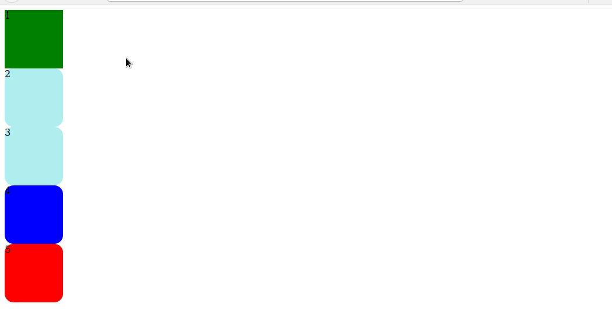

## Ejemplo vivo

https://codepen.io/fdodino/pen/LYGOaJV

## Especificidad

La [especificidad](https://developer.mozilla.org/es/docs/Web/CSS/Especificidad) en CSS indica de qué manera cada elemento adopta el estilo que le corresponde según las siguientes prioridades, partiendo de la más baja hasta la más alta:

- selectores por tag: `h1`, `div`, `p`, etc.
- selectores por clase/atributo, lo que en html se define con el atributo `class`
- selectores por identificador (atención que en una página HTML bien formada solo puede haber un identificador por elemento)
- estilos inline


> Desaconsejamos fuertemente el uso `important!` como técnica para forzar el cambio de prioridades en la definición de estilos.

En el artículo original de [Andy Clarke](https://stuffandnonsense.co.uk/archives/css_specificity_wars.html1), propone una graciosa metáfora para asociar las prioridades:

1. A storm trooper (element selector) is less powerful than Darth Maul (class selector*)
2. Darth Maul is less powerful than Darth Vader (ID selector)
3. Darth Vader is less powerful than the than the Emperor (style attribute)
4. The Death Star blows up everything

Incluso propone un [cheatsheet](https://stuffandnonsense.co.uk/archives/images/css-specificity-wars.png) para recordar las especificidades.

## Nuestro ejemplo

### Div solo

En el primer caso tenemos:

```html
<div>1</div>
```

Lo que produce que se vea verde porque nuestro archivo de estilos define:

```css
div {
  width: 100px;
  height: 100px;
  background-color: green;
}
```

Esto produce una especificidad de `0,0,0,1`:

| inline | identificador | clase | tag |
| ------ | ------ | ----- | ------ |
|0|0|0|1|
| | | | div |

Por eso vemos un rectángulo de color verde.

### Div cajita

Veamos ahora el siguiente ejemplo:

```
<div class="cajita">2</div>
```

Aquí tenemos una especificidad `0,0,1,1`:

| inline | identificador | clase | tag |
| ------ | ------ | ----- | ------ |
|0|0|1|1|
| | | .cajita | div |

```css
.cajita {
  border-radius: 15px;
  -webkit-border-radius: 15px;
  -moz-border-radius: 15px;
}
```

Esto produce únicamente una caja verde con borde redondeado, pero si le agregamos un color de fondo diferente, va a pisar la definición del estilo para el elemento `div`:

```css
.cajita {
  border-radius: 15px;
  -webkit-border-radius: 15px;
  -moz-border-radius: 15px;
  background-color: paleturquoise;
}
```

A continuación te mostramos cómo abrir en Firefox el modo Desarrollo con F12, y luego presionando el botón sobre la cajita podés ver qué propiedades tenés activadas y cuáles se inactivan porque tienen menos prioridad (incluso podés modificar esa prioridad para ver los cambios en el navegador):



Entonces lo veremos de color turquesa. Volvemos para atrás el cambio ya que los siguientes ejemplos necesitan que tengamos nuestro valor por defecto en verde.

### Tercera cajita

En esta definición

```html
<div class="cajita yellow">3</div>
```

aparecen dos clases, tenemos entonces especificidad `0,0,2,1`, y aquí la clase `yellow` pisa la definición de `div`, por eso vemos el rectángulo en amarillo.


## Material adicional

- [CSS Specificity: Things you should know](https://www.smashingmagazine.com/2007/07/css-specificity-things-you-should-know/)
- [Specifics on CSS Specificity](https://css-tricks.com/specifics-on-css-specificity/)
- [A Specificity Battle](https://css-tricks.com/a-specificity-battle/)