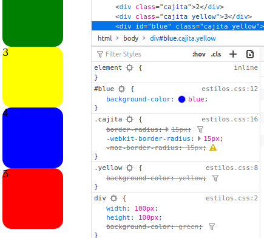
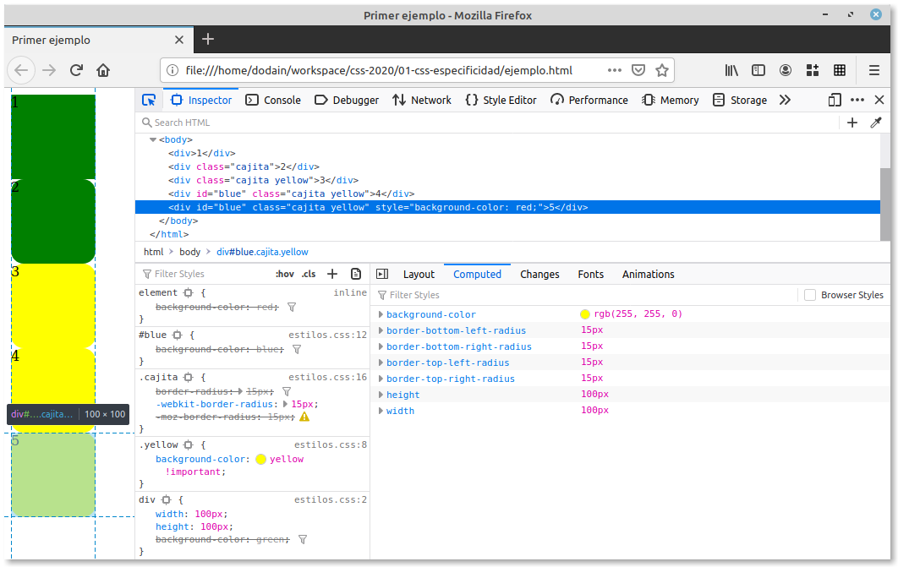

## Ejemplo vivo

https://codepen.io/fdodino/pen/LYGOaJV

## Especificidad

La [especificidad](https://developer.mozilla.org/es/docs/Web/CSS/Especificidad) en CSS indica de qué manera cada elemento adopta el estilo que le corresponde según las siguientes prioridades, partiendo de la más baja hasta la más alta:

- selectores por tag: `h1`, `div`, `p`, etc.
- selectores por clase/atributo, lo que en html se define con el atributo `class`
- selectores por identificador (atención que en una página HTML bien formada solo puede haber un identificador por elemento)
- estilos inline


> Desaconsejamos fuertemente el uso `important!` como técnica para forzar el cambio de prioridades en la definición de estilos.

En el artículo original de [Andy Clarke](https://stuffandnonsense.co.uk/archives/css_specificity_wars.html1), propone una graciosa metáfora para asociar las prioridades:

1. A storm trooper (element selector) is less powerful than Darth Maul (class selector*)
2. Darth Maul is less powerful than Darth Vader (ID selector)
3. Darth Vader is less powerful than the than the Emperor (style attribute)
4. The Death Star blows up everything

Incluso propone un [cheatsheet](https://stuffandnonsense.co.uk/archives/images/css-specificity-wars.png) para recordar las especificidades.

## Nuestro ejemplo

### Div solo

En el primer caso tenemos:

```html
<div>1</div>
```

Lo que produce que se vea verde porque nuestro archivo de estilos define:

```css
div {
  width: 100px;
  height: 100px;
  background-color: green;
}
```

Esto produce una especificidad de `0,0,0,1`:

| inline | identificador | clase | tag |
| ------ | ------ | ----- | ------ |
|0|0|0|1|
| | | | div |

Por eso vemos un rectángulo de color verde.

### Div cajita

Veamos ahora el siguiente ejemplo:

```
<div class="cajita">2</div>
```

Aquí tenemos una especificidad `0,0,1,1`:

| inline | identificador | clase | tag |
| ------ | ------ | ----- | ------ |
|0|0|1|1|
| | | .cajita | div |

```css
.cajita {
  border-radius: 15px;
  -webkit-border-radius: 15px;
  -moz-border-radius: 15px;
}
```

Esto produce únicamente una caja verde con borde redondeado, pero si le agregamos un color de fondo diferente, va a pisar la definición del estilo para el elemento `div`:

```css
.cajita {
  border-radius: 15px;
  -webkit-border-radius: 15px;
  -moz-border-radius: 15px;
  background-color: paleturquoise;
}
```

A continuación te mostramos cómo abrir en Firefox el modo Desarrollo con F12, y luego presionando el botón sobre la cajita podés ver qué propiedades tenés activadas y cuáles se inactivan porque tienen menos prioridad (incluso podés modificar esa prioridad para ver los cambios en el navegador):


Entonces lo veremos de color turquesa. Volvemos para atrás el cambio ya que los siguientes ejemplos necesitan que tengamos nuestro valor por defecto en verde.

> En general te recomendamos que hagas las pruebas en el navegador Firefox, porque tiene mejores herramientas que Google Chrome.

### Tercera cajita: class

En esta definición

```html
<div class="cajita yellow">3</div>
```

aparecen dos clases, tenemos entonces especificidad `0,0,2,1`, y aquí la clase `yellow` pisa la definición de `div`, por eso vemos el rectángulo en amarillo.


### Cuarta cajita: id

```html
<div id="blue" class="cajita yellow">4</div>
```

La especificidad es `0,1,2,1`, en particular para definir el color podemos ver que

| inline | identificador | clase | tag |
| ------ | ------ | ----- | ------ |
|0|1|2|1|
| | id="blue" -> azul | .yellow -> "amarillo" | div -> "verde" |



> **Nota**: dado que un html válido solo debe contener un único `id`, no recomendamos generar estilos que dependan de un identificador a menos que explícitamente debamos definir un estilo particular en un lugar muy específico.

### Quinta cajita: inline style

```html
<div style="background-color: red;" id="blue" class="cajita yellow">5</div>
```

Aquí tenemos una especificidad `1,1,2,1` que para el color aplican estas definiciones

| inline | identificador | clase | tag |
| ------ | ------ | ----- | ------ |
|1|1|2|1|
| inline -> rojo | id="blue" -> azul | .yellow -> "amarillo" | div -> "verde" |

Podemos ver cómo se van pisando los estilos en el navegador:


De la misma manera que desaconsejamos el uso de `id` para generar estilos, el estilo inline [tiene muchas desventajas](https://stackoverflow.com/questions/2612483/whats-so-bad-about-in-line-css):

- los cambios se van propagando por medio de copy/paste, por lo que cada modificación requiere editar manualmente uno por uno cada estilo
- al no centralizar el look & feel, es muy difícil generar un "dark mode" (modo claro/oscuro)
- los navegadores descargan los archivos de estilos una vez y lo guardan en una cache, por lo que si la siguiente página html usa la misma hoja de estilos el archivo ya estará descargado (mejora en performance)

### VIP: Very !important anti-Pattern

Otra "herejía" consiste en utilizar la declaración `!important` que echa por tierra las prioridades establecidas por la especificidad. Hagamos ahora este cambio en nuestro css:

```css
.yellow {
  background-color: yellow !important;
}
```

¿Qué sucede con las cajitas?



Las últimas tres se colorean con amarillo, porque el important deja como prioritaria la definición de la clase "yellow". Esto puede iniciar una guerra de importants, donde alguien decide colocar el `!important` para el id blue:

```css
#blue {
  background-color: blue !important;
}
```

y ahora tenemos las últimas dos cajas pintadas de azul, porque cuando se cruzan dos `!important` prevalece el criterio de especificidad, y recordemos que `id` > `class`.

Recordemos no obstante que **se considera una mala práctica** romper el criterio de especificidad a partir de definiciones arbitrarias de `!important` que ensucian nuestros códigos de estilos.


## Material adicional

- [CSS Specificity: Things you should know](https://www.smashingmagazine.com/2007/07/css-specificity-things-you-should-know/)
- [Specifics on CSS Specificity](https://css-tricks.com/specifics-on-css-specificity/)
- [A Specificity Battle](https://css-tricks.com/a-specificity-battle/)